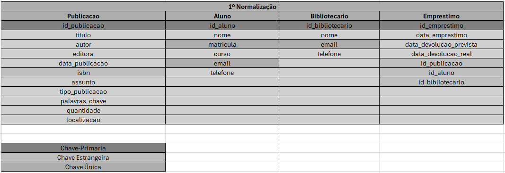
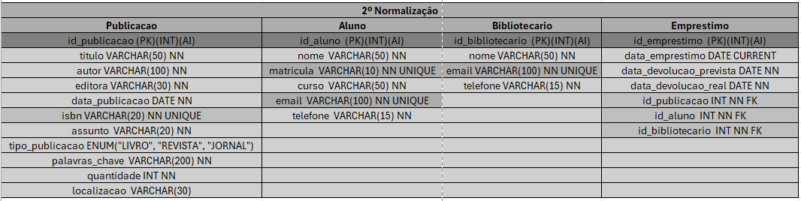
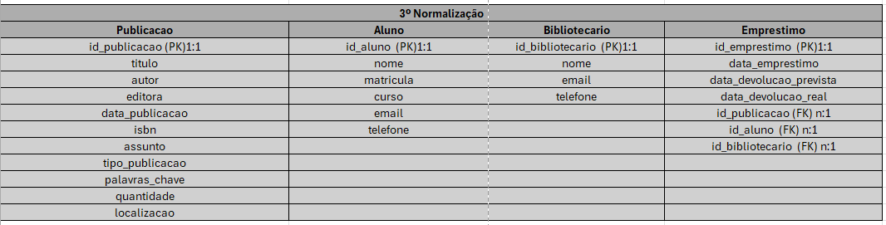
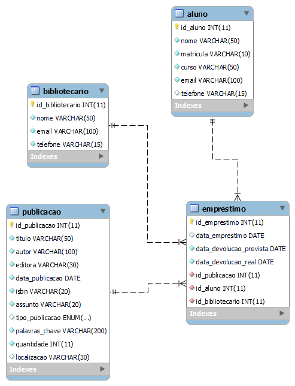

## Estudo de Caso: Banco de Dados para Biblioteca Escolar de Ensino Médio

### Introdução
Este estudo de caso tem como objetivo apresentar uma proposta para a criação de um banco de dados eficiente e completo para uma biblioteca escolar de ensino médio. A solução visa otimizar a gestão do acervo, facilitar a pesquisa dos alunos e fornecer informações precisas aos professores e bibliotecários.

### Análise das Necessidades

#### Usuários:

* Alunos: Realizar pesquisas, localizar livros e outros materiais, verificar a disponibilidade de itens.
* Professores: Elaborar listas de leitura, acompanhar o desempenho dos alunos e solicitar novas aquisições.
* Bibliotecários: Cadastrar novos itens, realizar empréstimos e devoluções, gerar relatórios e estatísticas.
Funcionalidades:
* Cadastro detalhado de itens: Título, autor, editora, ano de publicação, ISBN, assunto, palavras-chave, quantidade de exemplares, localização na biblioteca, status (disponível, emprestado, reservado).
* Cadastro de usuários: Nome completo, matrícula, curso, e-mail, telefone, histórico de empréstimos.
* Empréstimos e devoluções: Registro da data de empréstimo, data de devolução prevista, data de devolução real, renovações.
* Reservas: Possibilidade de reservar itens indisponíveis.
* Pesquisas: Realizar buscas por título, autor, assunto, palavras-chave, e outras combinações.
* Geração de relatórios: Relatórios de empréstimos, itens mais procurados, itens menos utilizados, estatísticas sobre o acervo.
* Gestão do acervo: Controle de entrada e saída de itens, acompanhamento do estado de conservação dos materiais.
* Integração com outros sistemas: Possibilidade de integrar com o sistema de gestão escolar para sincronizar dados de alunos e professores.
Projeto do Banco de Dados
Entidades e Atributos:
* Livro: Título, autor, editora, ano de publicação, ISBN, assunto, palavras-chave, quantidade de exemplares, localização.
* Usuário: Nome, matrícula, curso, e-mail, telefone.
* Empréstimo: Data de empréstimo, data de devolução prevista, data de devolução real, livro, usuário.
* Reserva: Data da reserva, livro, usuário.

#### Relacionamentos:

* Um livro pode ter muitos empréstimos.
* Um livro pode ter muitas reservas.
* Um usuário pode ter muitos empréstimos.
* Um usuário pode ter muitas reservas.


## Normalização

#### Normalização 1



#### Normalização 2



#### Normalização 3




### MODELO FÍSICO:


```sql
CREATE DATABASE biblioteca;
USE biblioteca;

CREATE TABLE publicacao (
id_publicacao INT AUTO_INCREMENT PRIMARY KEY,
titulo VARCHAR(50) NOT NULL,
autor VARCHAR(100) NOT NULL,
editora VARCHAR(30) NOT NULL,
data_publicacao DATE NOT NULL,
isbn VARCHAR(20) NOT NULL UNIQUE,
assunto  VARCHAR(20) NOT NULL,
tipo_publicacao ENUM("LIVRO", "REVISTA", "JORNAL"),
palavras_chave  VARCHAR(200) NOT NULL,
quantidade INT NOT NULL,
localizacao  VARCHAR(30)
);

CREATE TABLE aluno (
id_aluno INT AUTO_INCREMENT PRIMARY KEY,
nome VARCHAR(50) NOT NULL,
matricula VARCHAR(10) NOT NULL UNIQUE,
curso VARCHAR(50) NOT NULL,
email VARCHAR(100) NOT NULL UNIQUE,
telefone VARCHAR(15) 
);

CREATE TABLE bibliotecario (
id_bibliotecario INT AUTO_INCREMENT PRIMARY KEY,
nome VARCHAR(50) NOT NULL,
email VARCHAR(100) NOT NULL UNIQUE,
telefone VARCHAR(15) NOT NULL
);

CREATE TABLE emprestimo (
id_emprestimo INT AUTO_INCREMENT PRIMARY KEY,
data_emprestimo DATE DEFAULT CURRENT_TIMESTAMP(),
data_devolucao_prevista DATE NOT NULL,
data_devolucao_real DATE NOT NULL,
id_livro INT NOT NULL,
id_aluno  INT NOT NULL,
id_bibliotecario  INT NOT NULL 
);

-- Vamos alterar o nome da coluna da tabela emprestimo.
-- O campo id_livro será alterado para id_publicacao.

ALTER TABLE emprestimo
CHANGE COLUMN id_livro id_publicacao INT NOT NULL;

DESCRIBE emprestimo;

ALTER TABLE emprestimo
ADD CONSTRAINT fk_emprestimo_pk_publicacao
FOREIGN KEY emprestimo(id_publicacao)
REFERENCES publicacao(id_publicacao);

ALTER TABLE emprestimo
ADD CONSTRAINT fk_emprestimo_pk_aluno
FOREIGN KEY emprestimo(id_aluno)
REFERENCES aluno(id_aluno);

ALTER TABLE emprestimo
ADD CONSTRAINT fk_emprestimo_pk_bibliotecario
FOREIGN KEY emprestimo(id_bibliotecario)
REFERENCES bibliotecario(id_bibliotecario);
```
### DIAGRAMA

