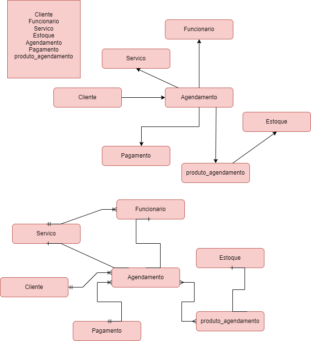
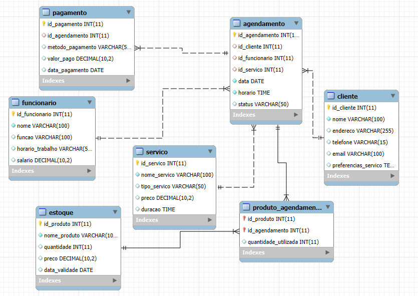

# Estudo de Caso: Salão de Cabelereiro "Cabelos Incríveis"

O salão e um estabeleciomento localizado em uma area movimentada da cidade. O salao oferece uma variedade de servicos, incluindo cortes de cabelo, coloração, tratamentos capilares, manicure e pedicure. Eles tem uma equipe de cabeleleiros talentosos e uma base de cliente fieis.

Desafio: O salão esta enferentando dificuldades para gerenciar eficientemente seus clientes, agendamentos, estoque de produtos e informacoes dos funcionarios. Eles precisam de um sistema de banco de dados para ajudar a organizar e automatizar esses processos.

## Requisitos do Sistema: gerenciamento de clientes.

Cadastro de novos clientes com informacoes como nome, endereço, telefone, e-mail, preferencias de servicos, historico de servicos realizados, etc.

Registro de servicos realizados por cada cliente, incluindo datas, tipos de servico, cabeleleiro responsavel, etc.
Possibilidade de atualizacao e exclusao de informacoes de clientes.

agendamento de serviços: Capacidade de agendar serviços para clientes, incluindo data, horario, tipo de serviço, cabeleleiro responsavel, etc.
Visualizacao rapida de disponibilidade de horarios e cabeleleiros para agendamento.

### Gerenciamento de estoque:

controle de estoque de produtos utilizados no salão, como tinturas, shampoos, condicionadores, etc.

### Informações de funcionarios:

Cadastro de informações dos funcionários, incluindo nome, função, horario de trabalho, salario, etc.

Atribuicao de serviços realizados por cada funcionario e acompanhemnto de seu desempenho 
<br>
<br>

# Modelo Conceitual do Estudo de Caso




<br>


# Modelo Lógico com as Normalizações

### Normalização 1


### Normalização 2


### Normalização 3


</br>

# Modelo Físico
### Código escrito em SQL

```sql

CREATE DATABASE cabelosincriveis;
use cabelosincriveis;

DROP TABLE IF EXISTS `cliente`;
CREATE TABLE `cliente` (
  `id_cliente` int(11) NOT NULL AUTO_INCREMENT,
  `nome` varchar(100) NOT NULL,
  `endereco` varchar(255) DEFAULT NULL,
  `telefone` varchar(15) DEFAULT NULL,
  `email` varchar(100) DEFAULT NULL,
  `preferencias_servico` text DEFAULT NULL,
  PRIMARY KEY (`id_cliente`)
) ENGINE=InnoDB DEFAULT CHARSET=utf8mb4 COLLATE=utf8mb4_general_ci;

LOCK TABLES `cliente` WRITE;
UNLOCK TABLES;

DROP TABLE IF EXISTS `funcionario`;
CREATE TABLE `funcionario` (
  `id_funcionario` int(11) NOT NULL AUTO_INCREMENT,
  `nome` varchar(100) NOT NULL,
  `funcao` varchar(100) DEFAULT NULL,
  `horario_trabalho` varchar(50) DEFAULT NULL,
  `salario` decimal(10,2) DEFAULT NULL,
  PRIMARY KEY (`id_funcionario`)
) ENGINE=InnoDB DEFAULT CHARSET=utf8mb4 COLLATE=utf8mb4_general_ci;

LOCK TABLES `funcionario` WRITE;
UNLOCK TABLES;

DROP TABLE IF EXISTS `servico`;
CREATE TABLE `servico` (
  `id_servico` int(11) NOT NULL AUTO_INCREMENT,
  `nome_servico` varchar(100) NOT NULL,
  `tipo_servico` varchar(50) DEFAULT NULL,
  `preco` decimal(10,2) DEFAULT NULL,
  `duracao` time DEFAULT NULL,
  PRIMARY KEY (`id_servico`)
) ENGINE=InnoDB DEFAULT CHARSET=utf8mb4 COLLATE=utf8mb4_general_ci;

LOCK TABLES `servico` WRITE;
UNLOCK TABLES;

DROP TABLE IF EXISTS `estoque`;
CREATE TABLE `estoque` (
  `id_produto` int(11) NOT NULL AUTO_INCREMENT,
  `nome_produto` varchar(100) NOT NULL,
  `quantidade` int(11) DEFAULT NULL,
  `preco` decimal(10,2) DEFAULT NULL,
  `data_validade` date DEFAULT NULL,
  PRIMARY KEY (`id_produto`)
) ENGINE=InnoDB DEFAULT CHARSET=utf8mb4 COLLATE=utf8mb4_general_ci;

LOCK TABLES `estoque` WRITE;
UNLOCK TABLES;

DROP TABLE IF EXISTS `agendamento`;
CREATE TABLE `agendamento` (
  `id_agendamento` int(11) NOT NULL AUTO_INCREMENT,
  `id_cliente` int(11) DEFAULT NULL,
  `id_funcionario` int(11) DEFAULT NULL,
  `id_servico` int(11) DEFAULT NULL,
  `data` date NOT NULL,
  `horario` time NOT NULL,
  `status` varchar(50) DEFAULT NULL,
  PRIMARY KEY (`id_agendamento`),
  KEY `id_cliente` (`id_cliente`),
  KEY `id_funcionario` (`id_funcionario`),
  KEY `id_servico` (`id_servico`),
  CONSTRAINT `agendamento_ibfk_1` FOREIGN KEY (`id_cliente`) REFERENCES `cliente` (`id_cliente`),
  CONSTRAINT `agendamento_ibfk_2` FOREIGN KEY (`id_funcionario`) REFERENCES `funcionario` (`id_funcionario`),
  CONSTRAINT `agendamento_ibfk_3` FOREIGN KEY (`id_servico`) REFERENCES `servico` (`id_servico`)
) ENGINE=InnoDB DEFAULT CHARSET=utf8mb4 COLLATE=utf8mb4_general_ci;

LOCK TABLES `agendamento` WRITE;
UNLOCK TABLES;


DROP TABLE IF EXISTS `pagamento`;
CREATE TABLE `pagamento` (
  `id_pagamento` int(11) NOT NULL AUTO_INCREMENT,
  `id_agendamento` int(11) DEFAULT NULL,
  `metodo_pagamento` varchar(50) DEFAULT NULL,
  `valor_pago` decimal(10,2) DEFAULT NULL,
  `data_pagamento` date DEFAULT NULL,
  PRIMARY KEY (`id_pagamento`),
  KEY `id_agendamento` (`id_agendamento`),
  CONSTRAINT `pagamento_ibfk_1` FOREIGN KEY (`id_agendamento`) REFERENCES `agendamento` (`id_agendamento`)
) ENGINE=InnoDB DEFAULT CHARSET=utf8mb4 COLLATE=utf8mb4_general_ci;

LOCK TABLES `pagamento` WRITE;
UNLOCK TABLES;

DROP TABLE IF EXISTS `produto_agendamento`;
CREATE TABLE `produto_agendamento` (
  `id_produto` int(11) NOT NULL,
  `id_agendamento` int(11) NOT NULL,
  `quantidade_utilizada` int(11) DEFAULT NULL,
  PRIMARY KEY (`id_produto`,`id_agendamento`),
  KEY `id_agendamento` (`id_agendamento`),
  CONSTRAINT `produto_agendamento_ibfk_1` FOREIGN KEY (`id_produto`) REFERENCES `estoque` (`id_produto`),
  CONSTRAINT `produto_agendamento_ibfk_2` FOREIGN KEY (`id_agendamento`) REFERENCES `agendamento` (`id_agendamento`)
) ENGINE=InnoDB DEFAULT CHARSET=utf8mb4 COLLATE=utf8mb4_general_ci;

LOCK TABLES `produto_agendamento` WRITE;
UNLOCK TABLES;
```

## Usando Comandos SQL

Adicionando  Dados Usando o Comando INSERT

``` sql
INSERT INTO Cliente (nome, endereco, telefone, email, preferencias_servico) 
VALUES ('Maria Silva', 'Rua A, 123', '1234567890', 'maria@email.com', 'Corte, Coloração');
INSERT INTO Funcionario (nome, funcao, horario_trabalho, salario) 
VALUES ('Ana Pereira', 'Cabeleireiro', '09:00 - 17:00', 2500.00);
INSERT INTO Servico (nome_servico, tipo_servico, preco, duracao) 
VALUES ('Corte de cabelo', 'Estético', 50.00, '00:30:00');
INSERT INTO Estoque (nome_produto, quantidade, preco, data_validade) 
VALUES ('Tintura X', 20, 30.00, '2025-12-31');
INSERT INTO Agendamento (id_cliente, id_funcionario, id_servico, data, horario, status) 
VALUES (1, 1, 1, '2024-10-20', '10:00', 'Confirmado');
INSERT INTO Pagamento (id_agendamento, metodo_pagamento, valor_pago, data_pagamento) 
VALUES (1, 'Cartão', 50.00, '2024-10-20');
INSERT INTO Produto_Agendamento (id_produto, id_agendamento, quantidade_utilizada) 
VALUES (1, 1, 2);
```

# Modelo de Entidade Relacional
### Diagrama do relacionamento (Cabelos Incriveis)

